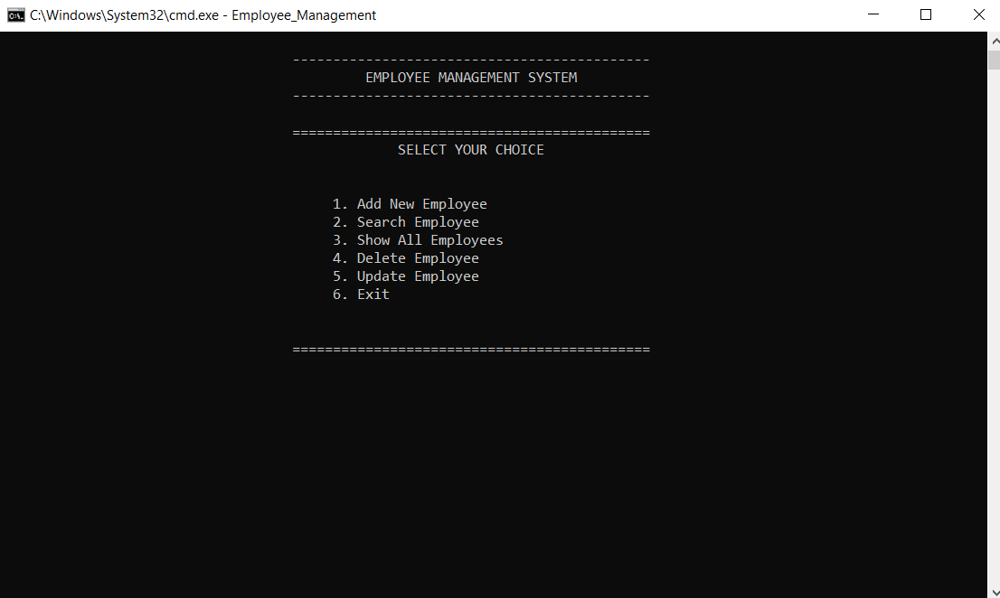
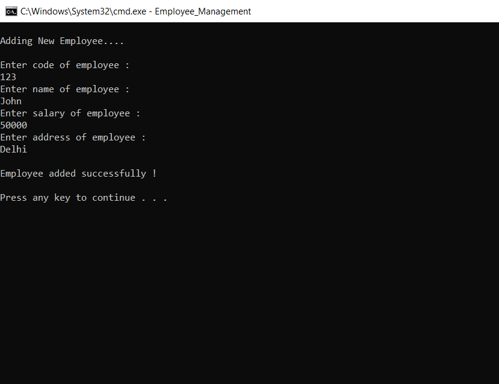
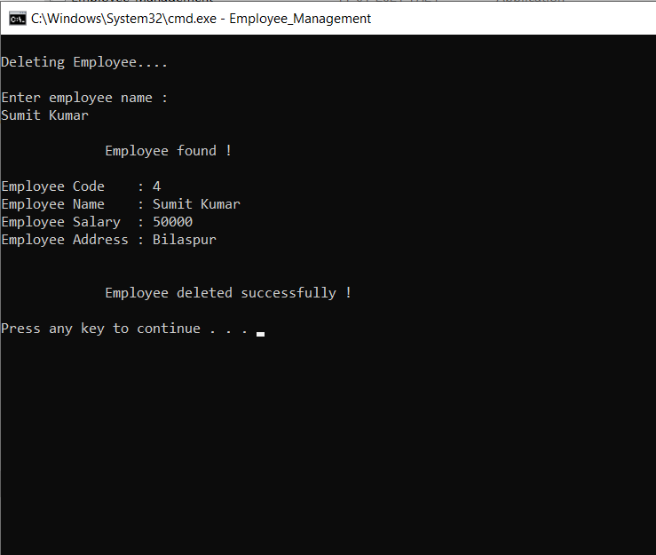
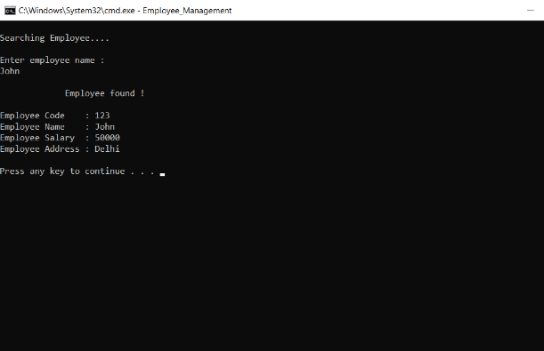
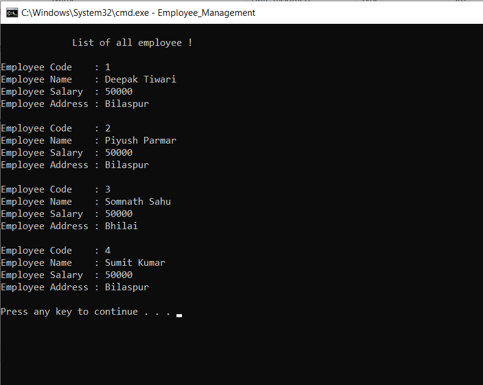
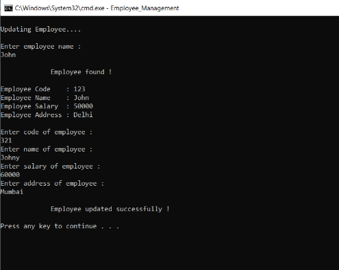

# CPP-File-Handling-Project
This is repository for my mini project I have done in file handling using cpp
By this program you can manage the data of all employee in an organization.
You can add , delete , search , update an employee and see the full list also.
I am also providing some snapshots of the program to understand it better. 

